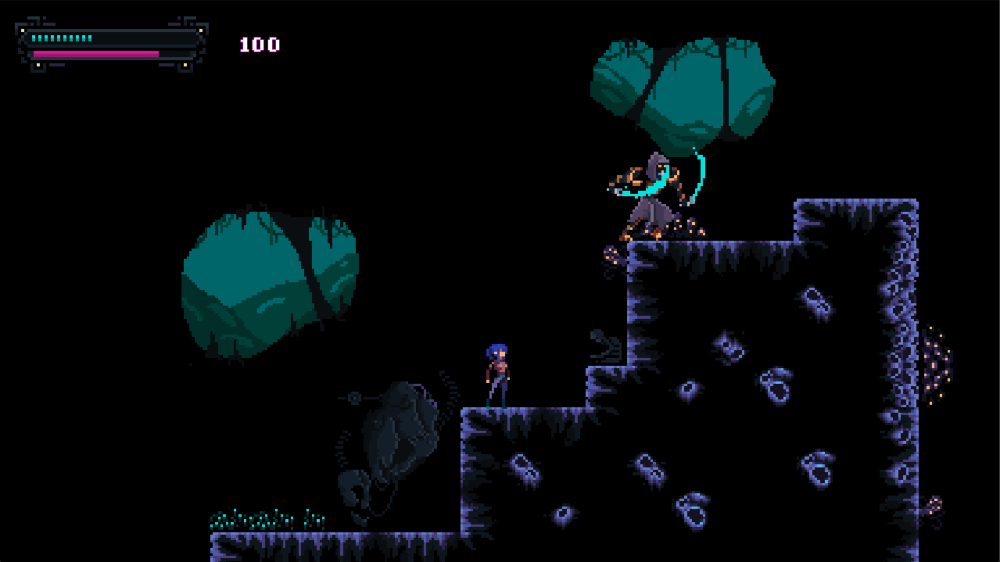

# Plague

[Godot Wild Jam 18](https://itch.io/jam/godot-wild-jam-18) entry made with
[Godot Engine](https://godotengine.org/).

[Play it on your browser!](https://david-saltares.itch.io/plague)

### Intro

The world has turned into a very dark place. First, dangerous electric storms fall from
the sky. But now... demons from hell plague the earth. All hope is lost.

However, you refuse to give up and will put up a fight for as long as you can!

### Features

* Procedurally generate infinite world
* Lightning storms
* Controller support!

### Godot Wild Jam

The main theme was "Plague" but there were also 3 additional wildcards, which we used:

80s style
Random/Chance elements
Weather/rain

### License

The code is distributed under the [Apache License](./LICENSE). The [game assets](./ASSETS.md)
are re-used and each pack may have different license agreements.

